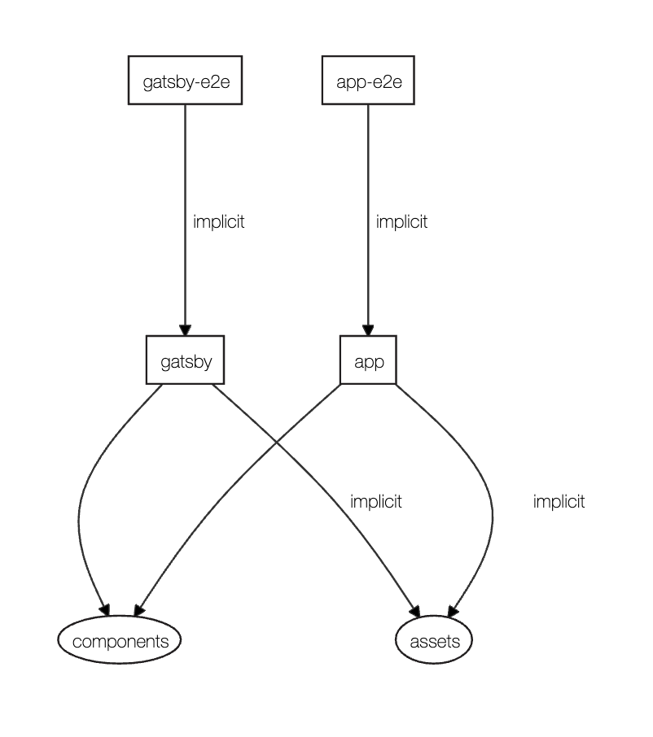

# NxGatsby

## Goal

- check how the Gatsby works with Nx

## Documentation

- [Nx](docs/nx.md)

  - [Nx Gatsby Plugin](docs/nx-gatsby-plugin.md)

- [Project creation commands (steps)](docs/project-creation-commands.md)

## Project dependency graph

> **implicit** - means some sort of manual configuration

## Findings

- at the first try it's possible to add the Gatsby site inside of the nx workspace, the only point until now was to add the support to the project it was needed to run the following command:

`npm i --save-dev @nrwl/gatsby gatsby-cli`

- to run the gatsby generate site inside of the nx workspace you should use the command:

`nx serve <generated-site-name>` (on this example it was `gatsby`)

- when I tried to run the lint over the e2e tests of the gatsby I notice a wrong configuration on the `workspace.json` which was set to the `apps/gatsby-e2e`, where it should use the same lint runner as the `apps/gatsby`

- when I runned the lint over the `apps/gatsby` I get some warning messages, to remove them, I needed to change the lint configuration on the `workspace.json` to ignore the `apps/gatsby/public` folder

- using the Gatsby inside of the Nx workspace it's basically like have 2 react applications, nothing special was notice to be able to use it

- to map the `libs/assets` into the gatsby application it was needed some extra manual steps because the gatsby doesn't supports the `baseUrl` from the `tsconfig.json`

## Links

- [React](https://reactjs.org/)

  - [React Router](https://reactrouter.com/)

- [Gatsby](https://www.gatsbyjs.org/)

  - [Gatsby Docs](https://www.gatsbyjs.org/docs/)

  - [gatsby-plugin-typescript](https://www.gatsbyjs.org/packages/gatsby-plugin-typescript/) - [caveats](https://www.gatsbyjs.org/packages/gatsby-plugin-typescript/?=#caveats)

  - [gatsby-plugin-root-import](https://www.gatsbyjs.org/packages/gatsby-plugin-root-import/)

  - [gatsby-source-filesystem](https://www.gatsbyjs.org/packages/gatsby-source-filesystem/)

    - [Sourcing from the Filesystem](https://www.gatsbyjs.org/docs/sourcing-from-the-filesystem/)

- [Nx: Extensible Dev Tools for Monorepos (React)](https://nx.dev/react)

  - [Plugins | Nx Docs](https://nx.dev/react/plugins/overview)

  - [[YouTube] Nx: Extensible Dev Tools for Monorepos (React)](https://www.youtube.com/watch?v=E188J7E_MDU)

  - [[YouTube] Nx Tutorial: High Quality React apps with Nx, Storybook & Cypress](https://www.youtube.com/watch?v=mfJBLhjYMdo)

  - [Gatsby support, custom workspace layouts, and more in Nx 9.4! | Nrwl](https://blog.nrwl.io/gatsby-support-custom-workspace-layouts-and-more-in-nx-9-4-497ae105bf4)

    - [Gatsby Plugin for Nx | NPM package](https://www.npmjs.com/package/@nrwl/gatsby)

    - [[GitHub] nrwl/gatsby](https://github.com/nrwl/gatsby) - Nx plugin for Gatsby

  - [Storybook](https://storybook.js.org/)

    - [[YouTube] Nx Tutorial: Nx Storybook Integration](https://www.youtube.com/watch?v=sFpqyjT7u4s)

    - [How to Use Storybook in an Nx Repo | Nx Docs](https://nx.dev/react/plugins/storybook/overview)

    - [Storybook support, run-many command, UI improvements, and more in Nx 8.8 | Nrwl](https://blog.nrwl.io/storybook-support-run-many-command-ui-improvements-and-more-in-nx-8-8-90575cb5dda4)

    - [Nx 8.8: Now You Can Write UI Tests with Storybook and Cypress | Nrwl](https://blog.nrwl.io/ui-testing-with-storybook-and-nx-4b86975224c)

    - [Creating a Storybook instance including stories from multiple libraries in a Nrwl Nx workspace](https://medium.com/front-end-weekly/creating-a-storybook-instance-including-stories-from-multiple-libraries-in-a-nrwl-nx-workspace-89009a2bddf7)

      - [[GitHub] juristr/nx-shared-storybook](https://github.com/juristr/nx-shared-storybook)

  - [Powering Up React Development With Nx | Nrwl](https://blog.nrwl.io/powering-up-react-development-with-nx-cf0a9385dbec)

  - [React Microfrontends and Monorepos: A Perfect Match | Nrwl](https://blog.nrwl.io/monorepos-and-react-microfrontends-a-perfect-match-d49dca64489a) - [demo](https://nrwl-nx-examples-cart.netlify.com/cart) | [code](https://github.com/nrwl/nx-examples)

## Development tip

- to make my life easier I have the current `node_modules` from the project mapped to the PATH env variable, that enables me to run the command `nx` directly, if you don't have if you must use the short cut mapped on the `package.json`, using it like `npm run nx ...` or it's also possible to use like `npx nx ...` (the `npx` will look into the local installed packages `./node_modules/` and on the global installed packages)

  - `./node_modules/.bin`

### Known Gatsby TypeScript support limitation

- [gatsby-plugin-typescript caveats](https://www.gatsbyjs.org/packages/gatsby-plugin-typescript/?=#caveats)

  > Does not support baseUrl. Workaround: use [gatsby-plugin-root-import](https://www.gatsbyjs.org/packages/gatsby-plugin-root-import/) and configure it to point the baseUrl value (also set baseUrl option in tsconfig.json file).

### Known issues on MacOS

- [How to fix the Node gyp Error: No Xcode or CLT version detected | Reactgo](https://reactgo.com/gyp-xcode-or-clt-version-detected/)
